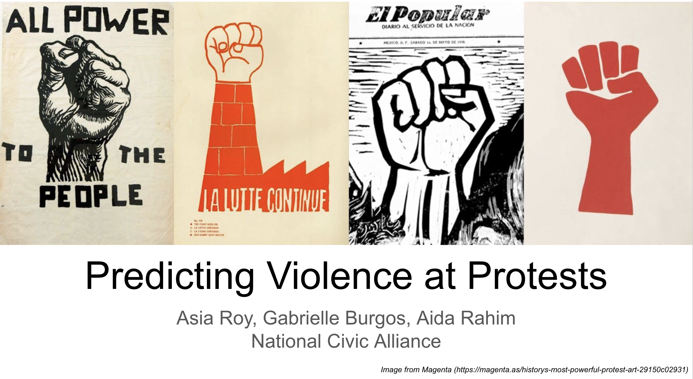
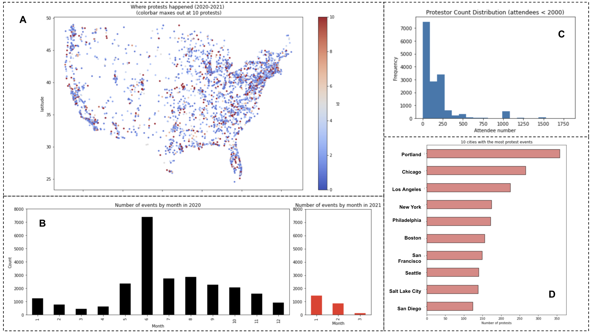

# Predicting Violence at Protests
Authors: Aida Rahim, Gabrielle Burgos, Asia Roy

## Executive Summary

Protests erupted across 2000 U.S. cities and 60 countries worldwide in support of the Black Lives Matter (BLM) movement following the killing of George Floyd by police in Minneapolis. Most protests were peaceful, though some escalated to violence, either from protestors or police. Protest participation is an important civic duty that we strongly support. It is perfectly reasonable to be concerned about safety, and want to participate only if the protest is peaceful with no threat of violence from either protestors or the police.

In this work, we use protest data from June 2020 (the month immediately following the killing of George Floyd) to build classification models that predict violence at protests. Our models provide some indication that with the data at hand, it is possible to predict this with an accuracy slightly better than the baseline accuracy (~90%). We suggest that more accurate models can be built by performing a more extensive cleanup of the data to remove conflicts ahead of model building, and that better results may be obtained with more intelligent clustering of data prior to modeling.

A presentation that summarizes the results described here is hosted on [Tableau Public](https://public.tableau.com/profile/asia5424#!/vizhome/PredictingViolenceatProtestsFinal/Introduction?publish=yes) (download locally for best viewing) and summarized in a PDF here.

## Introduction
On May 25, 2020, George Floyd was killed by police in Minneapolis. National (and international) civil unrest and protest arose in response, from a population plagued by police violence especially against the black population, and whose discontent was possibly exacerbated by Covid 19-related lockdowns. Protests erupted across 2000 cities and 60 countries in support of Black Lives Matter (BLM) movement. Most protests were peaceful, though some escalated to violence, either from protestors or police. We use the data collected here to predict violence occurring at protests, without discriminating between violence caused by protestors or violent police response.

#### Problem Statement:
Is it possible to predict violence erupting at protests?

## Exploratory Data Analysis

The following observations were made during the EDA process:
* The distribution of protests match the distribution of population density, as expected (A in figure above)
* The number of protests were suppressed in March 2020, probably due to the onset of Covid-related social and mobility restrictions (B in figure above)
* Protest numbers were highest in June 2020, following the killing of George Floyd by police in Minneapolis (B in figure above)
* Protest activity in Jan 2021 (which is also when the storming of the US Capitol occurred) is at a similar level as Jan 2020 (B in figure above)
* Most protests nationwide had attendee count in the few hundreds (C in figure above)
* The largest protest (in Washington D.C. in June 2020) had 200,000 attendees
* The 5 cities with the most protest events were: Portland, Chicago, Los Angeles, New York, and Philadelphia (D in figure above)
* The occurrence of violence at protests in these 5 cities (24%) is twice the national occurrence (12%)

For NLP analysis of the text in the 'Notes' section of the data, sentiment ratings provided by VADER were evaluated. The analysis showed that most statements were neutral, which corresponds well to the unbiased note-taking carried out by a reputable organization.

## Modeling

Numerical and categorical features were used for this classification problem. The subset event type value of ‘Peaceful protest’ was considered the target variable. This column was dummified to provide binary values where all events other than ‘Peaceful protest’ was considered 'Violent'. The majority class in the original, unmodified dataset was ~90%.

Specific features considered were: protest host(s), total population, poverty rate, percent of population holding bachelor degrees, mayor status, population political affiliation, historical unarmed death records. The rationale for selecting these features is the assumption that perhaps underlying social structure influences presence or absence of protest violence.

Since the goal was to use current data to predict future occurrences, we applied the train/test split to a data subset from June 2020, and built predictive classification models that were then applied to protests in other months throughout 2020 and 2021. The main assumption is that future occurrences of protest violence is related to current events.

7 classifier models were tried (Logistic Regression, K-Nearest Classifier, Decision Tree Classifier, Bagging Classifier, Random Forest Classifier, AdaBoost Classifier, and Support Vector Classifier) with hyperparameter tuning. Model performance was judged based on accuracy relative to the baseline. All these models performed at best only marginally better than baseline. Several methods were explored to improve model performance including downsampling from the majority class to reduce imbalance, carrying out principal component analysis (PCA) prior to modeling, and building a neural network model. While these resulted in much better performance on the June test set, performance on the larger dataset was greatly reduced.

We then attempted to cluster the data based on population size and built different models for cities below and above a threshold of 400,000. These resulted in better model performance for the larger cities, and worse for the smaller cities. However, this result is promising as it indicates that it may be possible to improve model performance by splitting the dataset into logical clusters prior to modeling.

## Conclusions / Recommendations

Protest participation is an important civic duty that we strongly support. It is perfectly reasonable to want to be concerned about safety, and want to participate only if the protest is peaceful with no threat of violence from either protestors or the police. Our models provide some indication that it is possible to build models to predict violence at protests, though we were not satisfied with their performance.

We recommend that the following be implemented in order to improve model performance:
* Review the data, applying a more extensive data cleanup protocol e.g. handling misnamed cities and missing population information
* Apply more intelligent clustering of the dataset prior to modeling
* Reduce imbalance in the dataset
* Apply PCA before modeling
* Combine text data with more opinionated datasets either from law enforcement or protester’s perspective. For example: twitter, subreddit channels, blogs
* Possibly relate text classification to police brutality datasets provided by protesters and activist

### APPENDIX

### 1. Repository Contents

#### 1.1. Folders:

1. Code - Jupyter Notebooks that contain the code used to generate results summarized in the Tableau presentation. These content of these notebooks is briefly described here. Notebook #01 should be run first but sequence does not matter for the rest.

  1.1. 01_Integrate_Datasets: load original datsets, inspect them, drop unnecessary columns, create unique ID for merging, save final integrated dataset

  1.2. 02_EDA: exploratory data analysis to uncover the stories contained within the integrated dataset

  1.3. 03_Models_Classification_PCA_NN: a train/test split is applied to the June 2020 data subset for model-building. Only numerical and categorical information is used. 7 classifier models (LogReg, KNC, DecisionTree, Bagging, Random Forest, AdaBoost, SupportVector) and Neural Net were explored.

  1.4. 04_Cluster_Models: the dataset is clustered by population before modeling

2. Data:

  .csv files of the original datasets gathered, along with the integrated and modified datasets. The data codebook is also included in this folder.

### 2. Data Description

The main dataset used for this project contains a list of protest events in the US starting Jan 2020 through March 2021 collected by the Armed Conflict Location & Event Data Project [(ACLED)](https://acleddata.com/special-projects/us-crisis-monitor/). It contains information on protest sponsors/hosts (actors) and attendees as well as a categorization of protest peacefulness and notes on each event. This dataset did not have explicit attendee count, so this was gathered from a second dataset from [Data.World](https://data.world/liz-friedman/us-protests-data-2017-onward) that originated from [countlove.org](https://countlove.org/), a project with the goal to help "citizens, journalists, and politicians make more compelling cases for a diverse, empathetic, and kind country." These datsets were supplemented by population demographic information obtained from [Dataverse](https://dataverse.harvard.edu/dataset.xhtml?persistentId=doi:10.7910/DVN/L2GSK6) hosted by Harvard University. While the protest data is current, population demographic data is from 2014. It was deemed sufficiently representative of current demographics, to be relevant.

1. protests in the US (2020-2021): [ACLED Protest Data](https://acleddata.com/special-projects/us-crisis-monitor/)
  * Data file: Protest_US_2020.csv
2. numbers of protesters at each protest event in the US (2020-2021): [Data.World](https://data.world/liz-friedman/us-protests-data-2017-onward)
  * Data file: US_protest_attendees.csv
3. population information (from 2014): [Dataverse](https://dataverse.harvard.edu/dataset.xhtml?persistentId=doi:10.7910/DVN/L2GSK6)
  * Data file: BLM_cities.csv

A complete data codebook is contained in the Data folder.

### 3. Software Requirements

The following python libraries are required to run the notebooks: Pandas, Numpy, Matplotlib, Seaborn, Missingno, Re, Wordcloud, Scikit-learn, Tensorflow.

---
